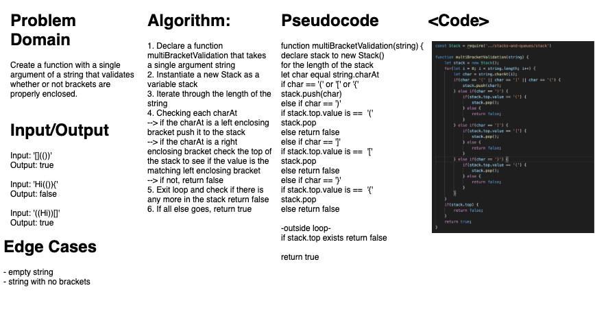

# Multi Bracket Validation
### Aysia Brown

### Challenge
- the challenge was to create a function with a single argument of a string, and to have the function return true or false depending on whether or not brackets were enclosed properly

### Approach & Efficiency
- the approach taken was to iterate over the length of the string and check every character at a given index if it was a bracket. If it was a left enclosing bracket, it is pushed to a stack. A stack was chosen because of its Last In First Out properties; that way we can check to see if a right enclosing bracket has a matching left enclosing bracket at the top of the stack. If not we return false.
- O(n) run time.

### Whiteboard
