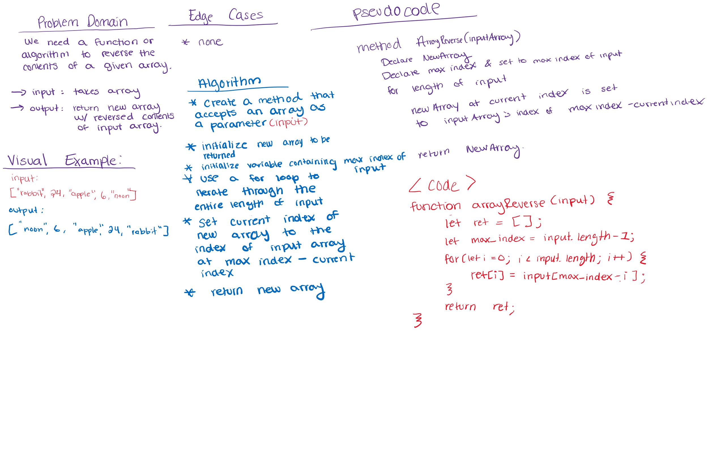

# Reverse an Array
### Aysia Brown
### Collaborated with: Andre-Olivier Martin

## Challenge
The problem domain involves taking an input of an array, and returning another array with the input array's contents reversed. 

## Approach & Efficiency 
Our approach was to first visualize what the initial input looked like and then would the returned output was supposed to look like. From there we jotted down the necessary steps of what our algorithm needed to accomplish. 

Take a look at the whiteboard below for additional details.

## Solution 
The solution we came up with was to create a method that accepted a single array as a parameter. 

The method would then declare a new empty array, and declare and set a variable equal to the max number of indices the input array had. 

The method would then continue to iterate through the length of the input, setting the current index of the new array to the index of the input array of max indices minus the current index (by doing this we are working out way backwards through the input array).
