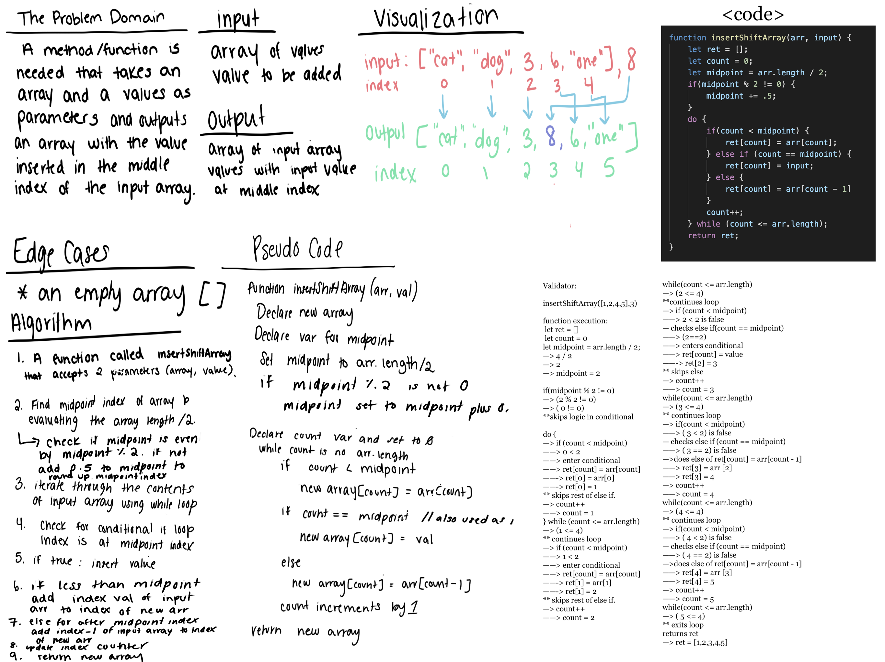

# Array Shift 
### Aysia Brown
### Collaborated with: Ricardo Barcenas 

## Challenge Description 
The problem domain was to create a function insertShiftArray that accepted two arguments, an array and a value and returns an array with the new value inserted at the middle index of the array and the additional array values shifted over. 

## Approach & Efficiency 
Visualizing the input and the expected output was helpful in indetifying what steps the algorithm needed to take to get there. Without being able to use Math.ceil, we had to account for rounding the 'middle' index in case of an odd number by hand. This was achieved by checking if the midpoint came out at a clean even number, and if not to manually add 0.5 to account for rounding up.

## Solution 

