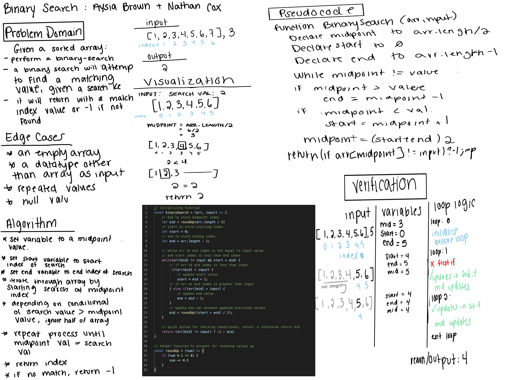

# Binary Search
### Aysia Brown
### Collaborated with: Nathan Cox 

## Challenge Description 
The problem domain was to create a function a Binary Search function given two arguments; a sorted array and a key value. A binary search iterates through the array first checking at the middle index value and comparing it to the key value. Depending on whether or not the key value or greater or lesser than, the algorithm is expected to keep halving the array depending on the midpoint index's value until either the index value equal to the key value is found, or it's not found and the function returns -1. 

## Approach & Efficiency 
Our first approach was to use a recursive method, however that required adding two additional parameters. To solve for not being able to take arguments for starting index and ending index, we initialized those variables within the function and our iterative logic was done with a while loop. 

## Solution 

[Additionl Resource W3School](w3resource.com/javascript-exercises/javascript-array-exercise-18.php)