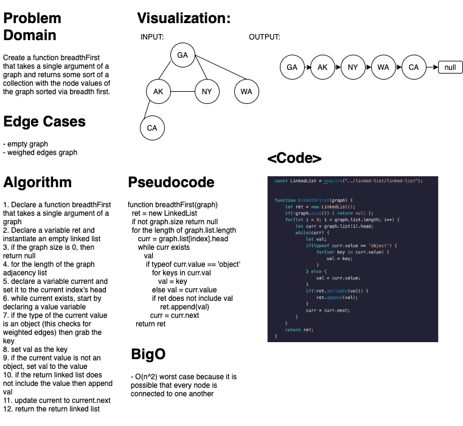

# Graph Breadth First Search
### Aysia Brown

### Challenge
- create a function breadthFirst that takes a single argument of a graph and returns a collection of all nodes in the graph sorted by a breadth first search. 

### Approach & Efficiency
- I wanted to save the collection as a LinkedList because the graph natively uses LinkedLists as apart of its adjacency list
- We would initialize an empty linked list to contain everything that needs to be returned, and then check if the graph size is 0. If it is 0, then the function would return null. 
- If the graph contained nodes, then for the entire length of the adjacency list, we will iterate through every index's Linked List of edges and add the values of where the edges point to 
- At the end we will return the LinkedList we initialized at the beginning
    - O(n^2) worse case time complexity because there is a potential that all the nodes have edges to all the nodes. 

### White Board
