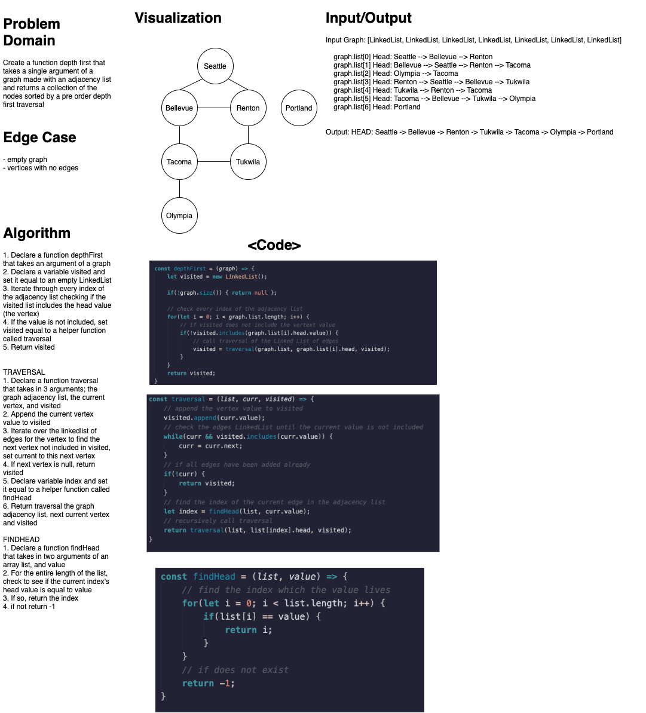

# Graph Depth First Search
### Aysia Brown

### Challenge
- Create a function to traverse a graph via depth first search and return the values of the graph in a collection where the values are sorted in pre-order traversal (pre-order: root, child)

### Approach & Efficiency
- Off the bat, this would have to be a recursive algorithm to iterate over the entire adjacency list, every vertex's linked list of edges, and the visited linked list. 
- First, we would need to iterate over every index of the adjacency list to reach every vertex in the graph, and if the vertex was not included in our visited list, we would then call another method traversal 
- Traversal appends the vertex value to visited and then iterates over the vertex's linked list of edges to find the next vertex that is not included in visited. Traversal is then recursively called to continue looping through all the vertices and edges in the graph. 
    - O(n^2) run time

### Whiteboard
