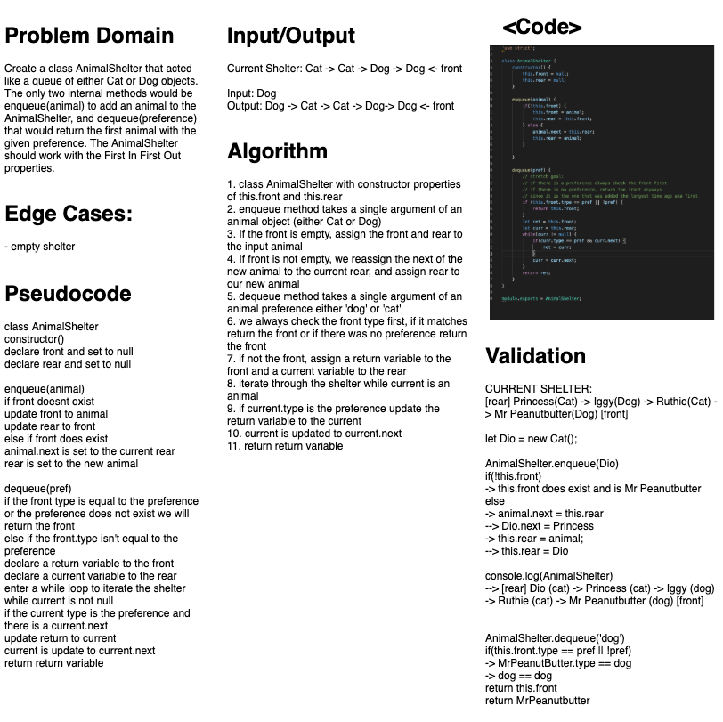

# FIFO Animal Shelter
### Aysia Brown
### Collaborated with: Ashley Moore, Garrett Cintron & Tahmina Ringer

### Challenge:
- The challenge was to create a class AnimalShelter that stored Cat or Dog objects as a queue following the "First In First Out" principle using methods enqueue and dequeue.

### Approach & Efficiency:
- First, I created an Animal class that contained the constructor of properites name, breed, age and next. 
- Next, I created a Dog class and a Cat class, both of which that extended Animal. The only difference was that Cat and Dog had a property type and sound that was preassigned to the given animal.
- AnimalShelter has two constructor properties of front and rear and upon initialization are set to null to indicate an empty AnimalShelter
- AnimalShelter enqueue(animal) method checks if the AnimalShelter is empty, if so we assign both the front and rear to the the new animal we are adding. If animals are already in the shelter, we assign the animal's next to the current rear, and then reassign rear to the new animal. 
    - O(1) run time.
- AnimalShelter dequeue(pref) checks if the front animal's type matches the pref(erence) criteria input or if there was no preference. If either of these match, we return the front animal. If the animal is automatically not the front, we start traversing through the rear, and updating a return variable as we reach the front. We will return our return variable. 
    - O(n) run time.

### Whiteboard
