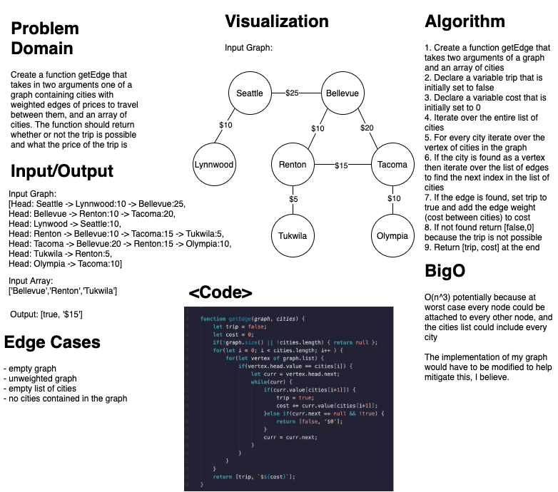

# GetEdge
### Aysia Brown

### Challenge
- Create a function getEdge that takes in two parameters of a graph and array of cities, returning whether or not the trip is possible and the cost. 

### Approach & Efficiency
- First, the cities array needs to be iterated through, and then we would need to iterate very vertex in the graph to find the if the city is included. If the city is included then we would iterate through the vertex for that city's list of edges to find the next city in the cities array. If the city is found we will add the cost of the edge to the costs variable. 
    - O(n^3) worst case scenario because there are 3 nested loops. I believe to mitigate this, the graph I created would need to be modified for easier access of the edges.

### Whiteboard

### Tests
- Happy case passes
- Fail case doesn't quite work. I believe it has to do with the trip boolean being misplaced, but I couldn't quite figure out where to put it. When I moved it, the reserve would hapen when the fail case would pass but then the happy case would fail. 
- Empty graph and/or cities array returns null 

