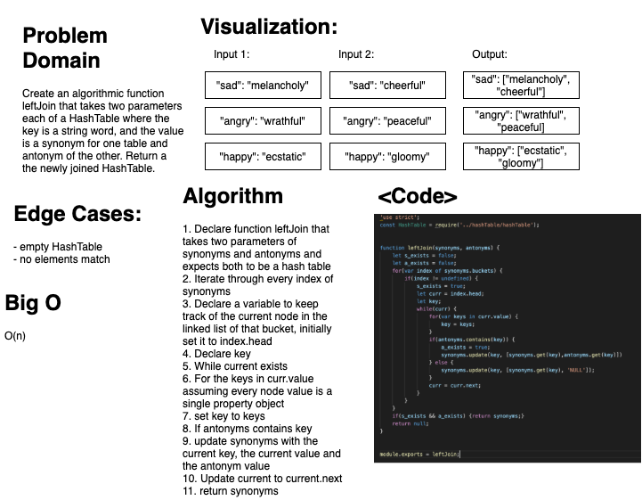

# Left Join
### Aysia Brown

### Challenge
- create a function left join that takes in two parameters each a hashtable where the key is a string word and the value is a synonym of the key for one hashtable and an antonym of the key for the other and return a hashtable where all same keys have the value of both the synonym and antonym.

### Approach & Efficiency
- The approach taken was the iterate over every index in synonyms.buckets and see if there was anything in the index. If there was assuming the bucket contained a linked list we would then iterate over the linked list and check every node's value object for a key. Then we would check if the second hashtable contained the key, and if true we would update the first hashtable with both the values. 
    - O(n) run time because we may be iterating through the entire length of buckets

### Whiteboard:
