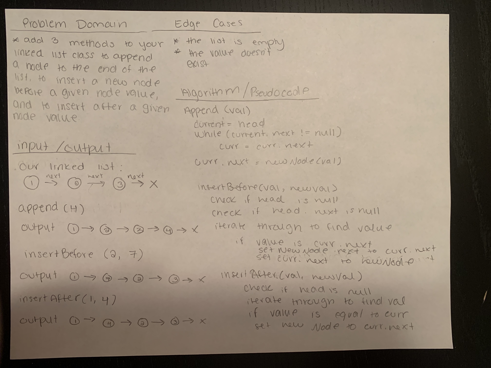
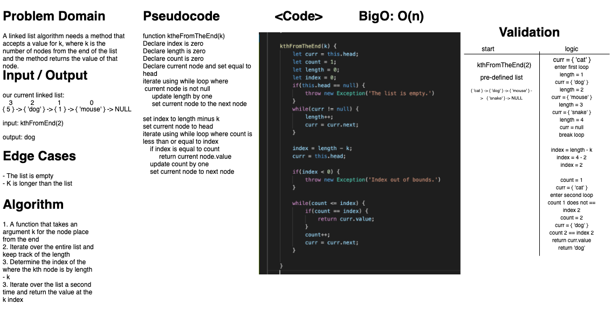

# Singley Linked List 
### Aysia Brown

## Challenge
- The challenge was create a Linked List where every unit of the Linked List was a node that pointed to the next node. The first Node would always be assigned as the head of the Linked List, otherwise null if the list was empty. If a node's next value pointed to null then that node would be the last node in the list. 

## Approach & Efficiency 
- My approach consisted of creating a class strictly for the individual Node's first. I knew the Node had to contain a value and then a pointer variable that would be assigned to null or the next node. 
- I then started on the Linked List class which would be constructed with a head value. The head value would always be the node at the top of the list or the last inserted node. 
- The insert method included checking if a head value already existed with a node or not; if not then head value would be reassigned to a new node. 
    - if the head value was already assigned to a Node, then a new node's next value would be reassigned to point at the head value's current node. Then we reassign the head value to be pointing at the new node we inserted. 
    - This method has a O(1) run time.
- The includes method will loop through every node's next node using a while loop where the current node & next node is not null. The current node's value and next node's value will be compared against the value the method is searching for. If the value exists we exit the loop and return true; otherwise we return false. 
    - includes runs at a O(n) run time.
- The toString method works similarly to includes by looping through the entire Linked List and adding the value to a string that will be returned. 
    - toString runs at a O(n) run time. 
- The append method iterates through the list to find the last node by searching if node.next is null. If node.next is null then the new Node will bet set to that. 
    - append has a O(n) run time
- The insertBefore and insertAfter methods were approached similarly by iterating through the list into the given value is found. If the value is the same value as the current node.next then we will insert the new nodes.next as current node.next and save current node.next as the new node (insertBefore). However, if the current node's value is the given value we will do the same reassigning of variables as above.
    - both insertBefoe and insertAfter run at O(n)
- The Kth from the End method takes an argument k and returns the value from the node that is kth numbers away from the end. Because there is no native .length or option to use a for loop, the implementation process included entering a first while loop that took count of every node in the linked list. We then find the 'index' of the kth from the end node by subtracting k from the total length. Another iterative loop is entered until we reach node with the index value, and we return the value for that node. 
    - kthFromTheEnd has a O(n) runtime. 

## API
- `LinkedList.insert(value)` will insert a new node at the head of the Linked List and assign it's next node as the former head's node.
- `LinkedList.includes(value)` will loop through the entire Linked List comparing a value to every Node value, stopping if found and returning `true`. Otherwise returning `false`. 
- `LinkedList.toString()` will print the entire contents's value of the Linked List in this notation: `{ a } -> { b } -> { c } -> NULL` 
- `LinkedList.append(value)` will append a new node to the end of the list 
- `LinkedList.insertBefore(value, newVal)` will insert a new node before a given node value in the list 
- `LinkedList.insertAfter(value, newVal)` will insert a new node after a given node value in the list  
- `LinkedList.kthFromTheEnd(k)` will return a value of the node that is k places from the end of the linekd list. 

## White Board
***NOTE:*** I'm still experimenting on the best whiteboarding process for my workflow. I apologize in advance!

*Linked List - Inserts:*

*Linked List - Kth From The End*
