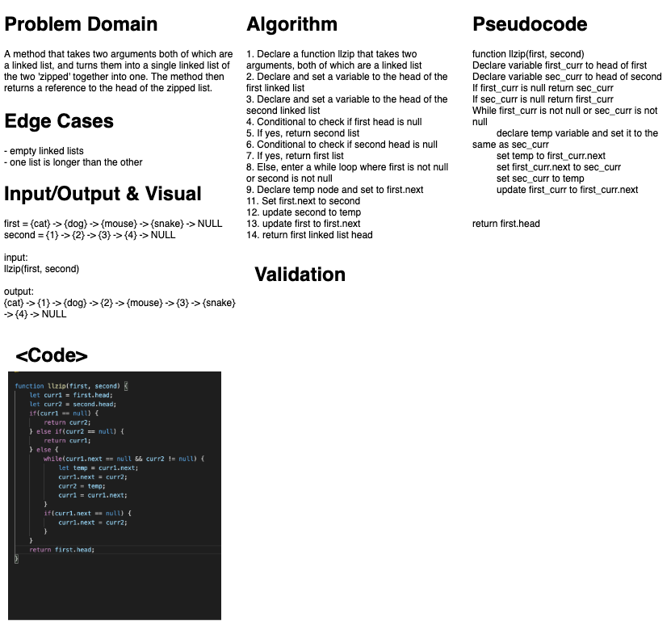

# LinkedList Zip
### Aysia Brown

### Challenge & Description
The challenge was to create a method that accepted two arguments, both of which linked lists and combined them by zipping them together where the node in the first linked list's next would point to the second linked list's node, and so on. 

### Approach & Efficiency 
The approach taken to solve the problem domain was to keep track of both the current node for both linked lists, and iterate through them, reassigning the next variable to the proper node and utilizing a variable temp so reference to the first.next node would not be lost. At the end the head of the first linked list is returned. This should run at a O(n) runtime. 

### Whiteboard
