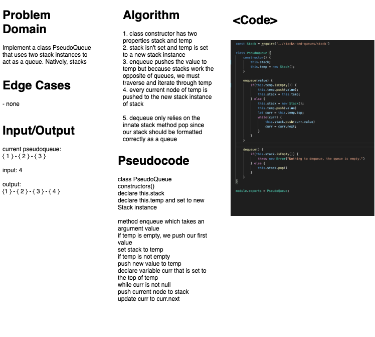

# PseudoQueue
### Aysia Brown

### Challenge
- the challenge was to create a new class Pseudoqueue that used two stacks as apart of the queue implementation. 

### Approach & Efficiency
- Since stacks work the opposite of queues by using a First In Last Out, I knew for enqueue that the original stack would have to be reversed to abide to the queue's principles of First In First Out. Essentially, it involved moving the first item to the last item of a stack. We have a temporary stack that holds every value added in the correct stack way, and then we use that temp stack to instantiate a new second stack that is our actual queue.

- `PseudoQueue.enqueue(value)` has a O(n) run time
- `PseudoQueue.dequeue()` has an O(1) run time

### Whiteboard
