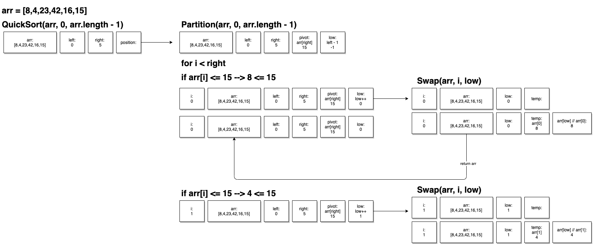

# Quick Sort

### Definition 
QuickSort is a comparison sorting algorithm that picks a pivot value to compare other values based on if they are greater or lesser value of the pivot. After all of that has been 'sorted', the original list of elements is split at the pivot point and the process restarts recursively until everything is sorted in order. 


### Pseudocode
Consider this pseudocode:

```
ALGORITHM QuickSort(arr, left, right)
    if left < right
        // Partition the array by setting the position of the pivot value 
        DEFINE position <-- Partition(arr, left, right)
        // Sort the left
        QuickSort(arr, left, position - 1)
        // Sort the right
        QuickSort(arr, position + 1, right)

ALGORITHM Partition(arr, left, right)
    // set a pivot value as a point of reference
    DEFINE pivot <-- arr[right]
    // create a variable to track the largest index of numbers lower than the defined pivot
    DEFINE low <-- left - 1
    for i <- left to right do
        if arr[i] <= pivot
            low++
            Swap(arr, i, low)

     // place the value of the pivot location in the middle.
     // all numbers smaller than the pivot are on the left, larger on the right. 
     Swap(arr, right, low + 1)
    // return the pivot index point
     return low + 1

ALGORITHM Swap(arr, i, low)
    DEFINE temp;
    temp <-- arr[i]
    arr[i] <-- arr[low]
    arr[low] <-- temp
```


### Algorithm Verification
Imagine our input array as `[8,4,23,42,16,15]` and we run `QuickSort([8,4,23,42,16,15], 0, arr.length-1)`

Our algorithm will run like the following:



### BigO
BigO time complexity is O(n^2) at its worst case since it may need to iterate over the length of the list twice. 
