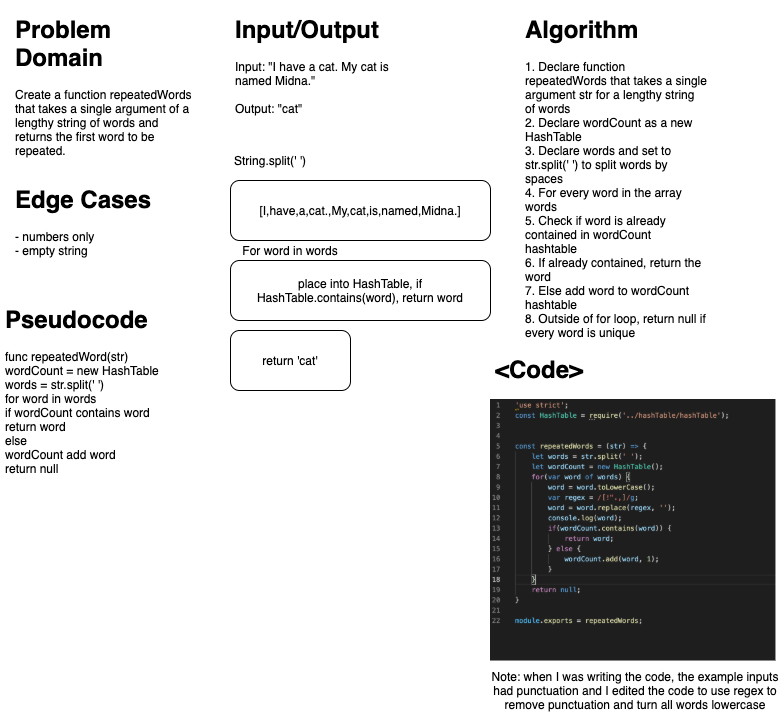

# Repeated Words 
### Aysia Brown

### Problem Domain
- Create a function repeatedWords that takes a single argument of a lengthy string (expects a string of words/sentences, etc.) and returns the first word that is repeated, otherwise returns null if all words are unique. 

### Approach & Efficiency 
- The approach taken was to split a string (assuming it was a string of sentences) by the empty spaces between the words and to store each word into a new Hash Table. To store the words, I had iterate over every value in the new array of words. For each word, I used regex to remove punctuation, and then turned the word lowercase before either checking if it was in the HashTable. If a word did end up being contained in the Hash Table, the algorithm would return true otherwise null if all words were unique. 
    - O(n) worst case run time because you may have to iterate through all the words in the string 

### Whiteboard
