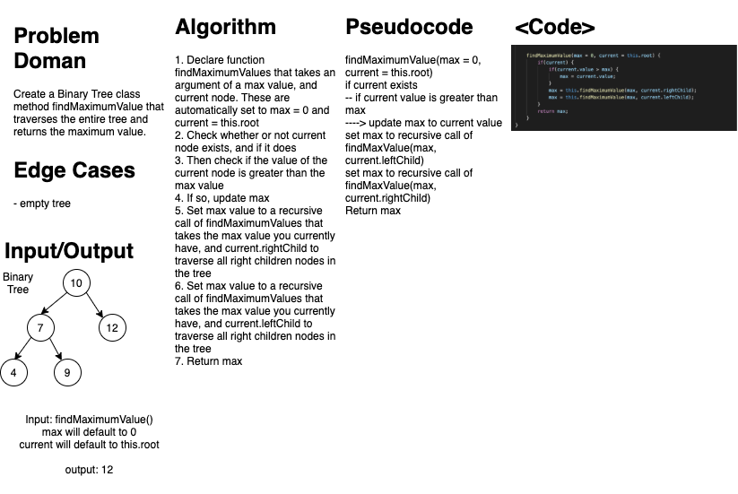
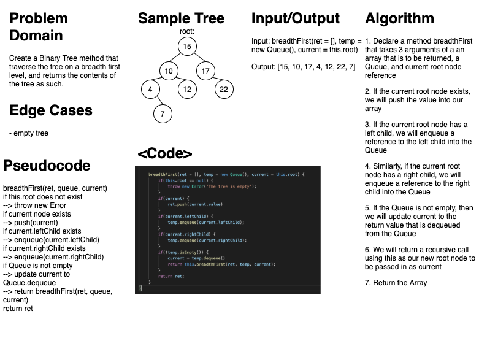

# Binary Search Tree
### Aysia Brown

### Challenge
- The challenge was to create a Binary Search Tree data structure. Unlike a traditional binary tree, binary search trees add Node based on their value. For example, if the a new value is greater than the root value then we add it to the right of of the root node, whereas if the value is less than the root value we add it to the left of the root node. 
- Furthermore, binary trees themselves have 3 different methods of returning all the values of the tree. 
    - preorder: returns the values in the order of root, left child, right child 
    - inorder: returns the values in order of left child, root, right child
    - postorder: returns the values in orer of left child, right child, root

### Approach & Efficiency
- Initially, I created a Node class that has the properties value, count, rightChild and leftChild
- Next, I created a class Binary Tree that has a propery root, and 3 methods: `preOrder(array, current)`, `inOrder(array, current)`, and `postOrder(array, current)`
    - all 3 of these methods are recursive in order to effectively traverse through the tree
    - all 3 take two arguments of an array and the current root node
    - O(n) run time
- A third class, Binary Search Tree was created that extends Binary Tree and has two of its own methods add and contains 
    - `add(value, current)` and `contains(value, current)` are also recursive, however due to the nature of the Binary Search Tree, we are only traversing through half the tree at any given time. 
    - O(log n) run time
- `BST.findMaximumValue()`uses recursion checking every left and right node of a root node, comparing the value to the current saved max value.
    - O(n) run time.
- `BST.breadthFirst(ret, temp, current)` where `ret` starts as an empty array, `temp` instantiates an empty Queue, and `current` is set to `this.root`. Breadth First Search uses recursion to add every child of a current root node to a queue, setting our current root node to the value of `temp.dequeue`. 
    -O(n) run time.

### API
- `BST.preOrder(array, current)` will return the values of the tree in an array in the following roder of root node, left child, right child. Upon the initial call `[]` should be passed in for `array` argument and `BST.root` should be passed in as the `current` root node argument 
- `BST.inOrder(array, current)` will return the values of the tree in an array in the following roder of left child, root node, right child. Upon the initial call `[]` should be passed in for `array` argument and `BST.root` should be passed in as the `current` root node argument 
- `BST.postOrder(array, current)` will return the values of the tree in an array in the following roder of left child, right child and root node. Upon the initial call `[]` should be passed in for `array` argument and `BST.root` should be passed in as the `current` root node argument 
- `BST.add(value, current)` will add values to the Binary Search Tree. If the value is less than the value of the root node, then the value will be added to the left child side of the root, however if the value is greater than the value of the root node than the value will be added to the right child side of the root. `value` is the value to be added, and `current` should always be instantiated as `BST.root`
    - if a value is added more than once, the count property of the node with the given value will be updated 
- `BST.contains(value, current)` will traverse through the tree returning either `true` if the value is in the tree or `false` if the value is not. Again, this method traverses the tree based on if the value we are searching for is lesser or greater than the root node. Lesser values will then to start only traversing the left side of the root, greater values will only start traversing the right side of the root. Upon initial call `value` is set to the value you are searching for and `current` is set to `BST.root`. 
- Due to the recursive nature of all these methods, we have to keep track of `current` which is the current root node.
- `BST.findMaximumValue()` using recursion traverses through ever right and left child of a given root node, and only updates the maxmimum value if the current value is greater. The maxmimum value is then returned. 
- `BST.breadthFirst(ret, temp, current)` returns an array and values of the tree determined by breadth first search. See visual diagram on Breadth First below of what Breadth First search searches. 

### Whiteboard
***FindMaximumValue***

***Breadth First***
