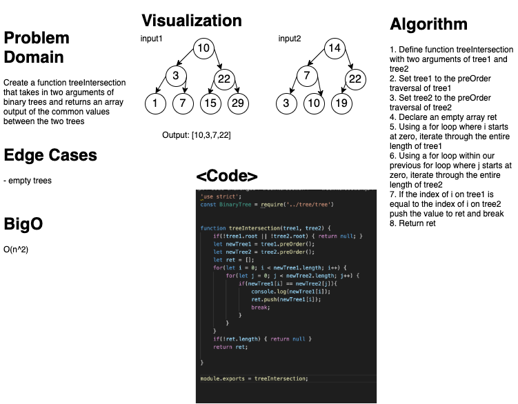

# TreeIntersection
### Aysia Brown

### Challenge
- Create a function that takes in two parameters each of binary tree and returns an array of shared values between them.

### Approach & Efficiency
- Each binary tree would have their values stored into invidiual arrays and traversed through pre-order traversal. Next, we would traverse through the first tree's array and compare the value to every value of the second array. If they match, we push the value into a return array and break the second for loop. 
    - O(n^2) efficiency since we are traversing a with a loop within a loop 

### Whiteboard
